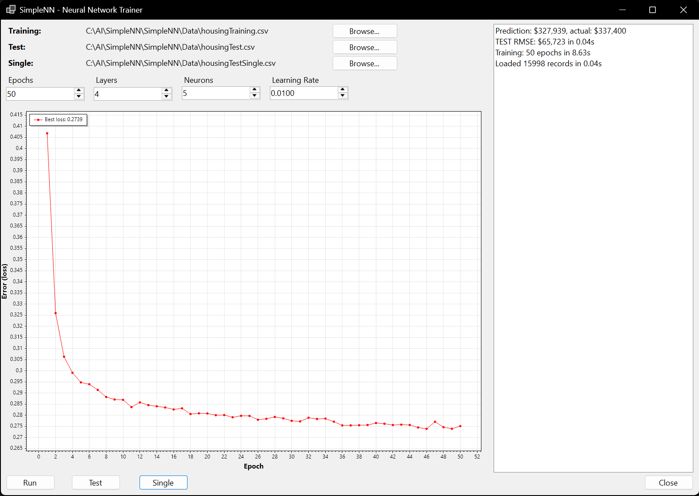

# SimpleNN

A small **feed-forward neural network built from scratch in C#** (no ML libraries), with a
Windows Forms UI to train it, plot the training loss, and evaluate it on the
[California Housing](https://www.kaggle.com/datasets/camnugent/california-housing-prices)
dataset — a classic regression problem (predicting median house value).

The network — layers, neurons, forward pass and backpropagation — is implemented by hand to
demonstrate how training actually works under the hood.



*The loss curve converges over 50 epochs of training; the log (right) shows the records
loaded, the training time, the test RMSE in dollars, and a single prediction vs. the actual value.*

## Features

- **Neural network from scratch**: dense layers, configurable activations
  (ReLU / Sigmoid / Tanh / Linear), He weight initialization, and full backpropagation
  with stochastic gradient descent.
- **Regression on real data**: loads a California-housing-style CSV, handles missing values,
  standardizes features and target, and reports the test error as **RMSE in dollars**.
- **Interactive WinForms UI**:
  - Pick your own **Training / Test / Single** CSV files from disk.
  - Tune **epochs, hidden layers, neurons per layer, and learning rate** before training.
  - **Run** trains the model and plots the loss curve (via [ScottPlot](https://scottplot.net/)).
  - **Test** evaluates the trained model on the held-out test set.
  - **Single** predicts one record and compares it to the real value.

## Tech stack

- **C# / .NET 8** (Windows Forms)
- [ScottPlot](https://scottplot.net/) for charting
- [Newtonsoft.Json](https://www.newtonsoft.com/json) for saving run results

## The three input files

| File         | Used by  | What it is                                                                 |
|--------------|----------|----------------------------------------------------------------------------|
| **Training** | Run      | Many rows (features + `median_house_value`); the network learns from it.   |
| **Test**     | Test     | A separate, unseen set; used to measure real error (RMSE in $).            |
| **Single**   | Single   | A single row; the model predicts its value and compares to the real label. |

Sample CSVs are included in [`Data/`](Data).

## Getting started

**Requirements:** Windows + [.NET 8 SDK](https://dotnet.microsoft.com/download).

```bash
git clone https://github.com/SlicelessBread/SimpleNN.git
cd SimpleNN
dotnet run --project SimpleNN.csproj
```

Then in the app: use the **Sfoglia…** (Browse) buttons to pick the CSV files (defaults point at
the bundled `Data/` files), set the hyperparameters, click **Run** to train, then **Test** to
evaluate.

## Project structure

```
SimpleNN/
├── NeuralNetwork/      # Network, Layer, Neuron — the model and backprop
├── Trainer/            # LoadData (CSV + normalization), MainTrainer (training loop, RMSE)
├── Data/               # Sample California-housing CSVs
├── Form1.cs            # WinForms UI: file selection, training, plotting, evaluation
└── Program.cs          # Entry point
```

## How it works

1. **Load & normalize** — `LoadData` parses the CSV, imputes missing values with the column mean,
   and standardizes features and the target using the **training** statistics only.
2. **Train** — `MainTrainer.Fit` runs SGD per sample, reshuffling each epoch, and logs the loss.
3. **Evaluate** — the test set is normalized with the *training* statistics; predictions are
   de-scaled back to dollars and compared to the true values to compute the RMSE.

## License

Released under the [MIT License](LICENSE).
